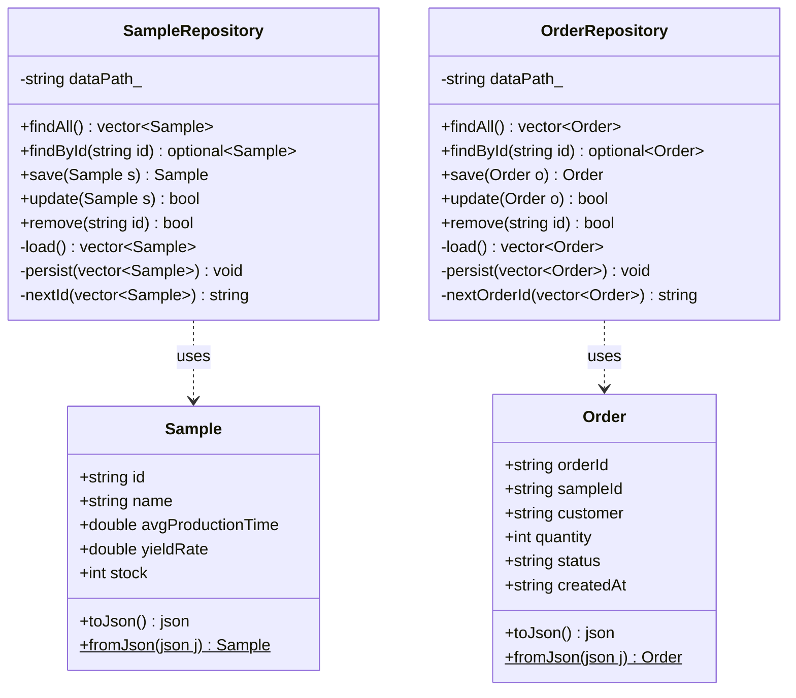

# DataPersistence — PoC 2: JSON 영속성 + CRUD 검증

S-Semi 시료 생산주문관리 시스템의 DataPersistence PoC입니다.
본 프로젝트(`SampleOrderSystem`)와 **동일한 `Sample` / `Order` 스키마**로
JSON 파일 기반 CRUD 및 앱 재시작 후 데이터 유지(영속성)를 검증합니다.

---

## 목차

1. [이 PoC의 목적](#1-이-poc의-목적)
2. [핵심 학습 포인트](#2-핵심-학습-포인트)
3. [레이어 구조](#3-레이어-구조)
4. [클래스 다이어그램](#4-클래스-다이어그램)
5. [핵심 코드 설명](#5-핵심-코드-설명)
6. [코드 동작 흐름](#6-코드-동작-흐름)
7. [프로젝트 구조](#7-프로젝트-구조)
8. [빌드 및 실행](#8-빌드-및-실행)
9. [입출력 예시](#9-입출력-예시)
10. [본 프로젝트와의 연관](#10-본-프로젝트와의-연관)

---

## 1. 이 PoC의 목적

| 검증 항목 | 방법 |
|---|---|
| `save()` — 데이터 등록 후 JSON 파일 생성 | 콘솔 입력 → JSON 파일 확인 |
| `findAll()` — 전체 목록 조회 | JSON → 객체 변환 후 출력 |
| `findById()` — ID로 단건 조회 / 없는 ID 오류 | 성공/실패 두 경로 확인 |
| `update()` — 수정 후 JSON 반영 | 파일 내용 직접 확인 |
| `remove()` — 삭제 후 목록 비어있음 | 삭제 후 재조회 |
| **영속성** — 앱 재시작 후 데이터 유지 | 종료 → 재시작 → 재조회 |

> 이 PoC에서 검증된 Repository 패턴이 `SampleOrderSystem`에 그대로 이식됩니다.

---

## 2. 핵심 학습 포인트

### 이 PoC에서 다루는 C++ 개념

| 개념 | 설명 | 사용된 곳 |
|---|---|---|
| `std::optional<T>` | 값이 없을 수 있는 반환형. `findById` 실패 시 `std::nullopt` | `SampleRepository::findById` |
| `std::filesystem` | 파일·디렉터리 존재 여부 확인, 디렉터리 생성 | `SampleRepository` 생성자 |
| `j.at("key")` vs `j["key"]` | `at()`은 키 없으면 예외, `[]`는 null 삽입 — 읽기 시 반드시 `at()` | `Sample::fromJson`, `Order::fromJson` |
| erase-remove 이디엄 | `remove_if`로 조건 필터 후 `erase`로 실제 삭제 | `SampleRepository::remove` |
| `j.dump(2)` | 들여쓰기 2칸 pretty-print JSON 문자열 | `SampleRepository::persist` |
| `localtime_s` | Windows 전용 thread-safe 로컬 시간 변환 | `OrderRepository::nextOrderId` |
| `std::snprintf` | 버퍼 크기 지정 안전 포매팅 (`sprintf` 대신) | `nextId`, `nextOrderId` |

---

### 설계 결정 사항

- **항상 전체 load → 수정 → persist 방식 사용**
  - 부분 쓰기(seek)보다 단순하고 버그가 없음
  - 시료/주문 수백 건 이하에서는 성능 차이 무시 가능
  - SampleOrderSystem에서도 동일한 패턴을 사용하므로 일관성 확보

- **`j.at("key")` 강제화**
  - `j["key"]`는 키 없을 때 null을 삽입해 JSON 파일을 오염시킴
  - `j.at("key")`는 키 없으면 `json::out_of_range` 예외를 던져 즉시 문제 감지 가능
  - 스키마 불일치를 조용히 넘기지 않고 명확한 오류로 알려주는 것이 더 안전

- **S-NNN / ORD-YYYYMMDD-NNNN ID 형식**
  - 시료: 3자리 제로패딩 (`S-001`, `S-002`) — 정렬 시 사전 순 = 번호 순 일치
  - 주문: 날짜 포함 (`ORD-20260715-0001`) — 날짜 바뀌면 시퀀스 리셋, 날짜별 발생량 추적 가능
  - SampleOrderSystem도 동일 형식 사용

- **Repository 생성자에서 data/ 초기화**
  - 생성자에서 `fs::create_directories("data")` + 빈 JSON 파일 생성
  - 사용자가 data/ 폴더를 수동으로 만들 필요 없이 첫 실행에 자동 구성

---

### 흔한 실수 / 주의사항

- **`j["key"]`로 읽으면 null이 파일에 삽입됨**
  `fromJson`에서 `j["id"]` 대신 `j.at("id").get<std::string>()`을 쓸 것.
  실수로 `j["id"]`를 쓰면 키가 없을 때 JSON 오브젝트에 `"id": null`이 추가되어 다음 파싱에서 오류 발생

- **erase-remove 이디엄에서 `erase` 생략 시 메모리 누수**
  `std::remove_if`는 삭제하지 않고 "뒤로 밀고" 새 끝 반복자를 반환할 뿐임.
  반드시 `.erase(새끝, .end())`로 실제 삭제해야 함

- **작업 디렉터리 문제 (`data/` 경로)**
  `x64/Release/DataPersistence.exe`를 직접 실행하면 `data/`가 exe 옆에 생성됨.
  VS에서 F5 또는 `cd DataPersistence && .\x64\Release\DataPersistence.exe`로 실행해야 `DataPersistence/data/`가 올바르게 잡힘

- **`localtime` vs `localtime_s`**
  `std::localtime`은 thread-unsafe (정적 버퍼 공유). Windows에서는 `localtime_s(&tm, &t)` 사용 필수

---

### 본 프로젝트(SampleOrderSystem)와의 연관

| 이 PoC에서 검증한 내용 | 본 프로젝트 적용 위치 |
|---|---|
| `Sample`/`Order` JSON 스키마 확정 | `SampleRepository`, `OrderRepository` 동일 스키마 사용 |
| load → 수정 → persist 패턴 | 모든 Repository의 write 연산에 동일 방식 적용 |
| `std::optional` 반환 패턴 | `SampleService`, `OrderService`의 단건 조회 메서드 전반 |
| ID 자동 채번 규칙 (S-NNN, ORD-날짜-NNNN) | SampleOrderSystem Repository에서 그대로 사용 |

---

## 3. 레이어 구조

이 PoC는 **Model + Repository** 두 레이어만 사용합니다.
`SampleOrderSystem`의 Service / Controller / View는 검증 범위 밖입니다.

```
┌─────────────────────────────────────────┐
│               main.cpp                  │  ← 콘솔 메뉴 (View 역할 임시 대행)
└────────────────┬────────────────────────┘
                 │  직접 호출
     ┌───────────▼──────────────┐
     │      Repository 레이어    │
     │  SampleRepository         │  ← samples.json CRUD
     │  OrderRepository          │  ← orders.json  CRUD
     └───────────┬──────────────┘
                 │  read / write
     ┌───────────▼──────────────┐
     │       Model 레이어        │
     │  Sample  (struct)         │  ← toJson() / fromJson()
     │  Order   (struct)         │  ← toJson() / fromJson()
     └───────────┬──────────────┘
                 │  직렬화 / 역직렬화
     ┌───────────▼──────────────┐
     │    data/ (JSON 파일)      │
     │  samples.json             │
     │  orders.json              │
     └──────────────────────────┘
```

| 레이어 | 파일 | 역할 | 금지사항 |
|---|---|---|---|
| **Model** | `model/Sample.h/.cpp`, `model/Order.h/.cpp` | 순수 데이터 구조 + JSON 직렬화 | 비즈니스 로직, I/O |
| **Repository** | `repository/SampleRepository.h/.cpp`, `repository/OrderRepository.h/.cpp` | JSON 파일 CRUD | 비즈니스 판단, cout |
| **진입점** | `main.cpp` | 메뉴 루프 + Repository 호출 | — |

---

## 4. 클래스 다이어그램



> `$` = static 메서드 | `optional~T~` = `std::optional<T>` | `vector~T~` = `std::vector<T>`

---

## 5. 핵심 코드 설명

### 5-1. Model — JSON 직렬화 / 역직렬화

```cpp
nlohmann::json Sample::toJson() const {
    return {
        {"id",                  id},
        {"name",                name},
        {"avg_production_time", avgProductionTime},
        {"yield_rate",          yieldRate},
        {"stock",               stock}
    };
}

Sample Sample::fromJson(const nlohmann::json& j) {
    Sample s;
    s.id                = j.at("id").get<std::string>();
    s.name              = j.at("name").get<std::string>();
    s.avgProductionTime = j.at("avg_production_time").get<double>();
    s.yieldRate         = j.at("yield_rate").get<double>();
    s.stock             = j.at("stock").get<int>();
    return s;
}
```

> `j.at("key")` — 키가 없으면 예외 발생 (안전). `j["key"]`는 null 삽입 (위험).

---

### 5-2. Repository — CRUD 패턴

```cpp
// 생성자: data/ 초기화
SampleRepository::SampleRepository() : dataPath_(DATA_PATH) {
    fs::create_directories("data");
    if (!fs::exists(dataPath_)) {
        std::ofstream f(dataPath_);
        f << "[]";
    }
}

// save: ID 자동 생성 후 추가
Sample SampleRepository::save(Sample sample) {
    auto samples = load();
    sample.id = nextId(samples);   // "S-001", "S-002" ...
    samples.push_back(sample);
    persist(samples);
    return sample;
}

// remove: erase-remove 이디엄
bool SampleRepository::remove(const std::string& id) {
    auto samples = load();
    auto before = samples.size();
    samples.erase(
        std::remove_if(samples.begin(), samples.end(),
            [&id](const Sample& s) { return s.id == id; }),
        samples.end());
    if (samples.size() == before) return false;
    persist(samples);
    return true;
}
```

---

### 5-3. ID 자동 생성 규칙

```cpp
// 시료: S-NNN (3자리 제로패딩)
std::string SampleRepository::nextId(const std::vector<Sample>& samples) const {
    if (samples.empty()) return "S-001";
    int maxNum = 0;
    for (const auto& s : samples)
        maxNum = std::max(maxNum, std::stoi(s.id.substr(2)));
    char buf[16];
    std::snprintf(buf, sizeof(buf), "S-%03d", maxNum + 1);
    return buf;
}

// 주문: ORD-YYYYMMDD-NNNN (날짜 포함, 날짜 바뀌면 시퀀스 리셋)
std::string OrderRepository::nextOrderId(const std::vector<Order>& orders) const {
    std::time_t t = std::time(nullptr);
    std::tm tm{};
    localtime_s(&tm, &t);
    char dateBuf[16];
    std::strftime(dateBuf, sizeof(dateBuf), "%Y%m%d", &tm);
    std::string prefix = std::string("ORD-") + dateBuf + "-";
    int maxSeq = 0;
    for (const auto& o : orders)
        if (o.orderId.rfind(prefix, 0) == 0)
            maxSeq = std::max(maxSeq, std::stoi(o.orderId.substr(prefix.size())));
    char buf[32];
    std::snprintf(buf, sizeof(buf), "ORD-%s-%04d", dateBuf, maxSeq + 1);
    return buf;
}
```

---

## 6. 코드 동작 흐름

### 시나리오 A — 시료 등록

```
사용자: "1" (시료 관리) → "3" (등록) → 이름/시간/수율/재고 입력
  │
  ▼
[main] addSample(sampleRepo)
  │
  ▼
[Repository] SampleRepository::save(sample)
  ├─ load()     ← samples.json 전체 읽기
  ├─ nextId()   ← 현재 최대 번호 + 1 → "S-001"
  ├─ push_back()
  └─ persist()  ← samples.json 전체 쓰기
  │
  ▼
"[완료] 시료가 등록되었습니다. (ID: S-001)" 출력
```

### 시나리오 B — ID 조회 (성공/실패)

```
[Repository] SampleRepository::findById("S-001")
  ├─ load() → 선형 탐색
  ├─ 찾음  → return optional<Sample>{sample}
  └─ 없음  → return std::nullopt

[main]
  ├─ 값 있음 → 상세 정보 출력
  └─ nullopt → "[오류] 존재하지 않는 ID" 출력
```

### 시나리오 C — 영속성 확인

```
1회 실행: 시료 등록 → persist() → samples.json 저장 → 앱 종료
2회 실행: SampleRepository 생성자 → 기존 samples.json 유지
          findAll() → load() → 이전 데이터 그대로 반환  ✅
```

---

## 7. 프로젝트 구조

```
DataPersistence-JOYUSIK-21044893/
├── README.md
├── .gitignore
└── DataPersistence/
    ├── DataPersistence.slnx        ← VS 솔루션
    ├── DataPersistence.vcxproj     ← 빌드 설정
    ├── main.cpp                    ← 진입점 + 콘솔 메뉴
    ├── model/
    │   ├── Sample.h / .cpp
    │   ├── Order.h / .cpp
    ├── repository/
    │   ├── SampleRepository.h / .cpp
    │   └── OrderRepository.h / .cpp
    ├── third_party/
    │   └── json.hpp                ← nlohmann/json 3.11.3
    └── data/
        ├── .gitkeep
        ├── samples.json            ← 런타임 생성 (git 제외)
        └── orders.json             ← 런타임 생성 (git 제외)
```

### vcxproj 핵심 설정

| 항목 | 값 | 이유 |
|---|---|---|
| `LanguageStandard` | `stdcpp17` | `std::optional`, `std::filesystem` 사용 |
| `AdditionalOptions` | `/utf-8` | 한글 인코딩 |
| `AdditionalIncludeDirectories` | `$(ProjectDir)` | `#include "model/Sample.h"` 형태 |
| `LocalDebuggerWorkingDirectory` | `$(ProjectDir)` | F5 실행 시 `data/` 기준점 |

---

## 8. 빌드 및 실행

### Visual Studio (권장)

1. `DataPersistence\DataPersistence.slnx` 더블클릭
2. 구성: `Release | x64`
3. **Ctrl+Shift+B** 빌드 → **F5** 실행

### MSBuild 터미널

```powershell
$msbuild = "C:\Program Files\Microsoft Visual Studio\18\Community\MSBuild\Current\Bin\MSBuild.exe"
& $msbuild DataPersistence\DataPersistence.vcxproj /p:Configuration=Release /p:Platform=x64

cd DataPersistence
.\x64\Release\DataPersistence.exe
```

---

## 9. 입출력 예시

### 케이스 A — 시료 등록 + ID 자동 생성

```
[1] 시료 관리 > [3] 등록
이름            > 실리콘 웨이퍼-8인치
평균생산시간(min) > 0.5
수율 (0~1)       > 0.92
초기재고         > 480
```
```
 [완료] 시료가 등록되었습니다. (ID: S-001)
```
```json
[{ "id": "S-001", "name": "실리콘 웨이퍼-8인치",
   "avg_production_time": 0.5, "yield_rate": 0.92, "stock": 480 }]
```

---

### 케이스 B — ID 조회 성공 / 실패

```
[1] 시료 관리 > [2] ID조회 > S-001
```
```
 ID : S-001 | 이름 : 실리콘 웨이퍼-8인치 | 재고 : 480
```
```
[1] 시료 관리 > [2] ID조회 > S-999
```
```
 [오류] 존재하지 않는 ID입니다: S-999
```

---

### 케이스 C — 재고 수정

```
[1] 시료 관리 > [4] 수정 > S-001 > 새 재고: 300
```
```
 현재 재고: 480
 [완료] 재고가 수정되었습니다.
```

---

### 케이스 D — 전체 삭제 후 빈 목록

```
[1] 시료 관리 > [5] 삭제 > S-001  [완료]
[1] 시료 관리 > [5] 삭제 > S-002  [완료]
[1] 시료 관리 > [1] 전체조회
```
```
 시료 목록 (총 0개)
 등록된 시료가 없습니다.
```

---

### 케이스 E — 영속성 (앱 재시작 후 데이터 유지)

```
1회 실행: S-001 등록 (재고 300) → 종료
2회 실행: [1] 전체조회
```
```
 S-001   실리콘 웨이퍼-8인치   300   ← 재시작 후에도 300 유지  ✅
```

---

### 케이스 F — 주문 ID 형식 (날짜별 시퀀스 리셋)

```
2026-07-15 등록 → ORD-20260715-0001
2026-07-15 등록 → ORD-20260715-0002
2026-07-16 등록 → ORD-20260716-0001  ← 날짜 바뀌면 0001부터 재시작
```

---

## 10. 본 프로젝트와의 연관

| 항목 | DataPersistence PoC | SampleOrderSystem |
|---|---|---|
| Sample 스키마 | 동일 | 동일 |
| Order 스키마 | 동일 | 동일 |
| Repository 인터페이스 | `findAll/findById/save/update/remove` | 동일 |
| JSON 파일 경로 | `data/samples.json`, `data/orders.json` | 동일 |
| Service 레이어 | 없음 (PoC 범위 외) | 있음 (비즈니스 로직) |
| Controller / View | 없음 (main.cpp 임시 대행) | 있음 |
