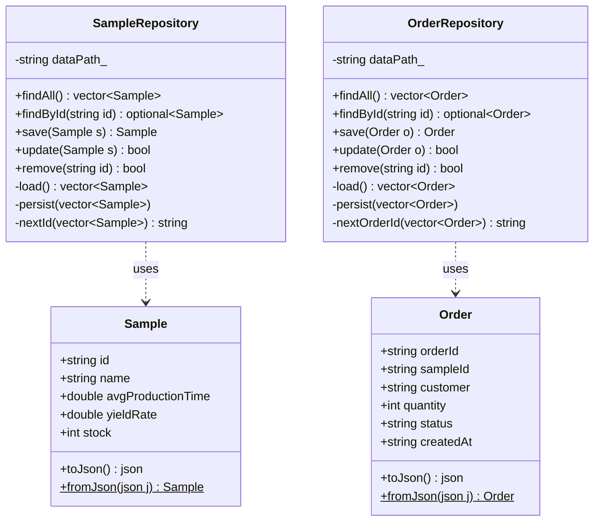

# DataPersistence-JOYUSIK-21044893 — PoC2: JSON 영속성 + CRUD 검증

S-Semi 시료 생산주문관리 시스템의 DataPersistence PoC입니다.  
본 프로젝트(`SampleOrderSystem`)와 **동일한 `Sample` / `Order` 스키마**로  
JSON 파일 기반 CRUD 및 앱 재시작 후 데이터 유지(영속성)를 검증합니다.

---

## 목차

1. [이 PoC의 목적](#1-이-poc의-목적)
2. [레이어 구조](#2-레이어-구조)
3. [클래스 다이어그램](#3-클래스-다이어그램)
4. [핵심 코드 설명](#4-핵심-코드-설명)
5. [코드 동작 흐름](#5-코드-동작-흐름)
6. [프로젝트 구조](#6-프로젝트-구조)
7. [빌드 및 실행](#7-빌드-및-실행)
8. [입출력 케이스](#8-입출력-케이스)
9. [본 프로젝트와의 연관](#9-본-프로젝트와의-연관)

---

## 1. 이 PoC의 목적

| 검증 항목 | 방법 |
|---|---|
| `save()` — 데이터 등록 후 JSON 파일 생성 | 콘솔 입력 → JSON 파일 확인 |
| `findAll()` — 전체 목록 조회 | JSON → 객체 변환 후 출력 |
| `findById()` — ID로 단건 조회 / 없는 ID 오류 | 성공/실패 두 경로 확인 |
| `update()` — 수정 후 JSON 반영 | 파일 내용 직접 확인 |
| `remove()` — 삭제 후 목록 비어있음 | 삭제 후 재조회 |
| **영속성** — 앱 재시작 후 데이터 유지 | 종료 → 재시작 → 재조회 |

> 이 PoC에서 검증된 Repository 패턴이 `SampleOrderSystem`에 그대로 이식됩니다.

---

## 2. 레이어 구조

이 PoC는 **Model + Repository** 두 레이어만 사용합니다.  
`SampleOrderSystem`의 Service / Controller / View는 검증 범위 밖입니다.

```
┌─────────────────────────────────────────┐
│               main.cpp                  │  ← 콘솔 메뉴 (View 역할 임시 대행)
└────────────────┬────────────────────────┘
                 │  직접 호출
     ┌───────────▼──────────────┐
     │      Repository 레이어    │
     │  SampleRepository         │  ← samples.json CRUD
     │  OrderRepository          │  ← orders.json  CRUD
     └───────────┬──────────────┘
                 │  read / write
     ┌───────────▼──────────────┐
     │       Model 레이어        │
     │  Sample  (struct)         │  ← toJson() / fromJson()
     │  Order   (struct)         │  ← toJson() / fromJson()
     └───────────┬──────────────┘
                 │  직렬화 / 역직렬화
     ┌───────────▼──────────────┐
     │    data/ (JSON 파일)      │
     │  samples.json             │
     │  orders.json              │
     └──────────────────────────┘
```

| 레이어 | 파일 | 역할 | 금지사항 |
|---|---|---|---|
| **Model** | `model/Sample.h/.cpp`<br>`model/Order.h/.cpp` | 순수 데이터 구조 + JSON 직렬화 | 비즈니스 로직, I/O |
| **Repository** | `repository/SampleRepository.h/.cpp`<br>`repository/OrderRepository.h/.cpp` | JSON 파일 CRUD | 비즈니스 판단, cout |
| **진입점** | `main.cpp` | 메뉴 루프 + Repository 호출 | — |

---

## 3. 클래스 다이어그램



> `$` 표시는 `static` 메서드입니다.  
> `optional<T>` — 값이 없을 수 있는 반환형 (C++17). 조회 실패 시 `std::nullopt` 반환.

---

## 4. 핵심 코드 설명

### 4-1. Model — JSON 직렬화 / 역직렬화

Model은 데이터 구조 + JSON 변환만 담당합니다. 비즈니스 로직과 I/O는 없습니다.

```cpp
// model/Sample.h — 선언만 (구현은 .cpp)
struct Sample {
    std::string id;
    std::string name;
    double avgProductionTime;
    double yieldRate;
    int stock;

    nlohmann::json toJson() const;            // 객체 → JSON
    static Sample fromJson(const nlohmann::json& j); // JSON → 객체
};
```

```cpp
// model/Sample.cpp — 구현
nlohmann::json Sample::toJson() const {
    return {
        {"id",                  id},
        {"name",                name},
        {"avg_production_time", avgProductionTime},
        {"yield_rate",          yieldRate},
        {"stock",               stock}
    };
}

Sample Sample::fromJson(const nlohmann::json& j) {
    Sample s;
    s.id                = j.at("id").get<std::string>();
    s.avgProductionTime = j.at("avg_production_time").get<double>();
    // ... 나머지 필드
    return s;
}
```

> `j.at("key")` — 키가 없으면 예외 발생 (안전한 접근).  
> `j["key"]` — 키가 없으면 null 삽입 (위험).

---

### 4-2. Repository — JSON 파일 CRUD

Repository는 JSON 파일을 **항상 전체 로드 → 수정 → 전체 저장** 방식으로 처리합니다.

```cpp
// repository/SampleRepository.cpp

// ── 생성자: data/ 폴더 및 빈 JSON 파일 자동 생성 ──────────────
SampleRepository::SampleRepository() : dataPath_(DATA_PATH) {
    fs::create_directories("data");
    if (!fs::exists(dataPath_)) {
        std::ofstream f(dataPath_);
        f << "[]";              // 빈 배열로 초기화
    }
}

// ── save: ID 자동 생성 후 추가 ────────────────────────────────
Sample SampleRepository::save(Sample sample) {
    auto samples = load();          // 전체 로드
    sample.id = nextId(samples);    // S-001, S-002 ... 자동 부여
    samples.push_back(sample);
    persist(samples);               // 전체 저장
    return sample;
}

// ── update: ID 일치하는 항목만 교체 ──────────────────────────
bool SampleRepository::update(const Sample& sample) {
    auto samples = load();
    for (auto& stored : samples) {
        if (stored.id == sample.id) {
            stored = sample;        // 통째로 교체
            persist(samples);
            return true;
        }
    }
    return false;                   // 없으면 false
}

// ── remove: erase-remove 이디엄 ──────────────────────────────
bool SampleRepository::remove(const std::string& id) {
    auto samples = load();
    auto before = samples.size();
    samples.erase(
        std::remove_if(samples.begin(), samples.end(),
            [&id](const Sample& s) { return s.id == id; }),
        samples.end());
    if (samples.size() == before) return false; // 삭제된 것 없음
    persist(samples);
    return true;
}
```

> **erase-remove 이디엄**: `std::remove_if`는 조건 일치 항목을 뒤로 밀고 새 끝 반복자를 반환합니다.  
> `erase`로 실제 삭제해야 메모리에서 제거됩니다.

---

### 4-3. ID 자동 생성 규칙

```cpp
// 시료 ID: S-NNN (기존 최대 번호 + 1)
std::string SampleRepository::nextId(const std::vector<Sample>& samples) const {
    if (samples.empty()) return "S-001";
    int maxNum = 0;
    for (const auto& s : samples) {
        int num = std::stoi(s.id.substr(2)); // "S-001" → "001" → 1
        if (num > maxNum) maxNum = num;
    }
    char buf[16];
    std::snprintf(buf, sizeof(buf), "S-%03d", maxNum + 1); // 3자리 제로패딩
    return buf;
}

// 주문 ID: ORD-YYYYMMDD-NNNN (오늘 날짜 + 일련번호)
std::string OrderRepository::nextOrderId(const std::vector<Order>& orders) const {
    std::time_t t = std::time(nullptr);
    std::tm tm{};
    localtime_s(&tm, &t);              // Windows 전용 안전 버전
    char dateBuf[16];
    std::strftime(dateBuf, sizeof(dateBuf), "%Y%m%d", &tm);

    int maxSeq = 0;
    std::string prefix = std::string("ORD-") + dateBuf + "-";
    for (const auto& o : orders) {
        if (o.orderId.rfind(prefix, 0) == 0) { // prefix로 시작하면
            int seq = std::stoi(o.orderId.substr(prefix.size()));
            if (seq > maxSeq) maxSeq = seq;
        }
    }
    char buf[32];
    std::snprintf(buf, sizeof(buf), "ORD-%s-%04d", dateBuf, maxSeq + 1);
    return buf;
}
```

---

### 4-4. 내부 load / persist (공통 패턴)

```cpp
// 파일 → 객체 벡터
std::vector<Sample> SampleRepository::load() const {
    std::ifstream f(dataPath_);
    if (!f.is_open()) throw std::runtime_error("파일을 열 수 없습니다: " + dataPath_);
    auto j = nlohmann::json::parse(f); // JSON 파싱
    std::vector<Sample> samples;
    for (const auto& entry : j)
        samples.push_back(Sample::fromJson(entry)); // 역직렬화
    return samples;
}

// 객체 벡터 → 파일
void SampleRepository::persist(const std::vector<Sample>& samples) const {
    nlohmann::json j = nlohmann::json::array();
    for (const auto& s : samples) j.push_back(s.toJson()); // 직렬화
    std::ofstream f(dataPath_);
    f << j.dump(2); // 들여쓰기 2칸으로 pretty-print
}
```

> `j.dump(2)` — 2칸 들여쓰기 JSON 문자열. `j.dump()` 는 한 줄 압축.

---

### 4-5. main.cpp — 메뉴 구조

```cpp
// 타입 별칭으로 가독성 개선
using ActionMap = std::unordered_map<std::string, std::function<void()>>;

// 서브메뉴 실행 함수 (분리로 main() 30줄 이하 유지)
static void runSubMenu(const std::string& title, const ActionMap& actions) {
    // ... 메뉴 출력 후 actions[선택]() 호출
}

int main() {
    SetConsoleOutputCP(CP_UTF8); // Windows 한글 출력
    SetConsoleCP(CP_UTF8);       // Windows 한글 입력

    SampleRepository sampleRepo; // 생성자에서 data/ 초기화
    OrderRepository  orderRepo;

    // 메뉴 번호 → (제목, ActionMap) 매핑
    const std::unordered_map<std::string,
          std::pair<std::string, const ActionMap*>> menuMap = {
        {"1", {"시료 관리", &sampleActions}},
        {"2", {"주문 관리", &orderActions}},
    };
    // 이벤트 루프 ...
}
```

---

## 5. 코드 동작 흐름

### 시나리오 A — 시료 등록 (`1` → `3`)

```
사용자: "1" (시료 관리) → "3" (등록) → 이름/시간/수율/재고 입력
  │
  ▼
[main] addSample(sampleRepo)
  │  view: 콘솔 입력 수집
  │
  ▼
[Repository] SampleRepository::save(sample)
  ├─ load()          ← samples.json 전체 읽기
  ├─ nextId()        ← 현재 최대 번호 + 1 → "S-001"
  ├─ push_back()     ← 새 시료 추가
  └─ persist()       ← samples.json 전체 쓰기
  │
  ▼
[main] "[완료] 시료가 등록되었습니다. (ID: S-001)" 출력
```

### 시나리오 B — ID 조회 (`1` → `2`)

```
사용자: "1" → "2" → ID 입력
  │
  ▼
[Repository] SampleRepository::findById("S-001")
  ├─ load()          ← JSON 전체 읽기
  ├─ 선형 탐색       ← id 일치 항목 찾기
  │
  ├─ 찾음  → return optional<Sample>{sample}
  └─ 없음  → return std::nullopt
  │
  ▼
[main]
  ├─ s 가 값 있음 → 상세 정보 출력
  └─ s 가 nullopt → "[오류] 존재하지 않는 ID" 출력
```

### 시나리오 C — 영속성 확인

```
1회 실행
  └─ 시료 등록 → persist() → samples.json 저장 → 앱 종료

2회 실행 (재시작)
  └─ SampleRepository 생성자
       └─ data/ 존재 확인 → 기존 samples.json 그대로 유지
  └─ findAll() → load() → 이전 데이터 그대로 반환  ✅ 영속성 확인
```

---

## 6. 프로젝트 구조

```
DataPersistence-JOYUSIK-21044893/
├── README.md
└── DataPersistence/
    ├── DataPersistence.slnx        ← VS 솔루션 (더블클릭으로 열기)
    ├── DataPersistence.vcxproj     ← 빌드 설정 (include 경로, /utf-8 옵션)
    ├── main.cpp                    ← 진입점 + 콘솔 메뉴
    ├── model/
    │   ├── Sample.h                ← struct 선언 + toJson/fromJson 선언
    │   ├── Sample.cpp              ← toJson/fromJson 구현
    │   ├── Order.h
    │   └── Order.cpp
    ├── repository/
    │   ├── SampleRepository.h      ← CRUD 인터페이스 선언
    │   ├── SampleRepository.cpp    ← CRUD 구현 + nextId
    │   ├── OrderRepository.h
    │   └── OrderRepository.cpp     ← CRUD 구현 + nextOrderId
    ├── third_party/
    │   └── json.hpp                ← nlohmann/json 3.11.3 단일 헤더
    └── data/
        ├── .gitkeep                ← data/ 폴더 git 추적용
        ├── samples.json            ← 런타임 자동 생성 (git 제외)
        └── orders.json             ← 런타임 자동 생성 (git 제외)
```

### vcxproj 핵심 설정

| 항목 | 값 | 이유 |
|---|---|---|
| `LanguageStandard` | `stdcpp17` | `std::optional`, `std::filesystem` 사용 |
| `AdditionalOptions` | `/utf-8` | 소스 파일 한글 인코딩 |
| `AdditionalIncludeDirectories` | `$(ProjectDir)` | `#include "model/Sample.h"` 형태 사용 |
| `LocalDebuggerWorkingDirectory` | `$(ProjectDir)` | F5 실행 시 `data/` 경로 기준점 |

---

## 7. 빌드 및 실행

### Visual Studio (권장)

1. `DataPersistence\DataPersistence.slnx` 더블클릭
2. 상단 구성: `Release | x64`
3. **Ctrl+Shift+B** → 빌드
4. **F5** → 실행

> ⚠️ **F5로 실행**해야 작업 디렉터리가 `DataPersistence\`로 설정되어 `data/` 경로가 올바르게 잡힙니다.  
> 탐색기에서 `.exe` 직접 실행 시 `data/` 위치가 달라질 수 있습니다.

### 터미널 (MSBuild)

```powershell
$msbuild = "C:\Program Files\Microsoft Visual Studio\18\Community\MSBuild\Current\Bin\MSBuild.exe"
& $msbuild DataPersistence\DataPersistence.vcxproj /p:Configuration=Release /p:Platform=x64

# 반드시 DataPersistence\ 폴더에서 실행
cd DataPersistence
.\x64\Release\DataPersistence.exe
```

---

## 8. 입출력 케이스

### CASE 1 — 시료 등록 `save()` + ID 자동생성

```
[1] 시료 관리 > [3] 등록
이름            > 실리콘 웨이퍼-8인치
평균생산시간(min) > 0.5
수율 (0~1)       > 0.92
초기재고         > 480
```
```
 [완료] 시료가 등록되었습니다. (ID: S-001)
```
```json
// data/samples.json
[{ "id": "S-001", "name": "실리콘 웨이퍼-8인치",
   "avg_production_time": 0.5, "yield_rate": 0.92, "stock": 480 }]
```

---

### CASE 2 — 전체조회 `findAll()`

```
[1] 시료 관리 > [1] 전체조회
```
```
============================================================
 시료 목록 (총 2개)
============================================================
 ID      이름              재고  수율  생산시간(min)
------------------------------------------------------------
 S-001   실리콘 웨이퍼-8인치480     0.92    0.5
 S-002   GaN 에피 웨이퍼   120     0.85    1.2
```

---

### CASE 3a — ID 조회 성공 `findById()` ✅

```
[1] 시료 관리 > [2] ID조회 > S-001
```
```
 ID           : S-001
 이름         : 실리콘 웨이퍼-8인치
 재고         : 480
 수율         : 0.92
 평균생산시간 : 0.5 min
```

### CASE 3b — ID 조회 실패 — 없는 ID ❌

```
[1] 시료 관리 > [2] ID조회 > S-999
```
```
 [오류] 존재하지 않는 ID입니다: S-999
```

---

### CASE 4 — 재고 수정 `update()`

```
[1] 시료 관리 > [4] 수정 > S-001 > 새 재고: 300
```
```
 현재 재고: 480
 [완료] 재고가 수정되었습니다.
```
```json
// samples.json 수정 후
{ "id": "S-001", "stock": 300, ... }
```

---

### CASE 5 — 영속성: 앱 재시작 후 데이터 유지 ✅

앱 종료 후 재시작 → `[1] 전체조회` 시 수정된 재고(300) 그대로 조회됨.

```
 S-001   실리콘 웨이퍼-8인치300     0.92    0.5   ← 재시작 후에도 300 유지
 S-002   GaN 에피 웨이퍼   120     0.85    1.2
```

---

### CASE 6 — 주문 등록 + `ORD-YYYYMMDD-NNNN` 형식 검증

```
[2] 주문 관리 > [3] 등록
시료 ID > S-001
고객명  > 삼성전자 파운드리
수량    > 200
```
```
 [완료] 주문이 등록되었습니다. (주문ID: ORD-20260715-0001)
```
```
(두 번째 등록)  → ORD-20260715-0002
(다음 날 등록)  → ORD-20260716-0001   ← 날짜 바뀌면 일련번호 리셋
```

---

### CASE 7 — 주문 상태변경 `update()` RESERVED → CONFIRMED

```
[2] 주문 관리 > [4] 수정 > ORD-20260715-0001
새 상태 > CONFIRMED
```
```
 현재 상태: RESERVED
 [완료] 상태가 변경되었습니다.
```

지원 상태: `RESERVED` → `CONFIRMED` / `PRODUCING` / `RELEASE` / `REJECTED`

---

### CASE 8 — 시료 삭제 `remove()` + 빈 목록 확인

```
[1] 시료 관리 > [5] 삭제 > S-001  → [완료]
[1] 시료 관리 > [5] 삭제 > S-002  → [완료]
[1] 시료 관리 > [1] 전체조회
```
```
 시료 목록 (총 0개)
 등록된 시료가 없습니다.
```

---

## 9. 본 프로젝트와의 연관

| 항목 | DataPersistence PoC | SampleOrderSystem |
|---|---|---|
| Sample 스키마 | 동일 | 동일 |
| Order 스키마 | 동일 | 동일 |
| Repository 인터페이스 | `findAll/findById/save/update/remove` | 동일 |
| JSON 파일 경로 | `data/samples.json`, `data/orders.json` | 동일 |
| Service 레이어 | 없음 (PoC 범위 외) | 있음 (비즈니스 로직) |
| Controller / View | 없음 (main.cpp 임시 대행) | 있음 |

> **DataMonitor(PoC3)** 와 **DummyDataGenerator(PoC4)** 는  
> 이 PoC와 동일한 JSON 스키마의 `data/` 폴더를 직접 읽고 삽입합니다.
